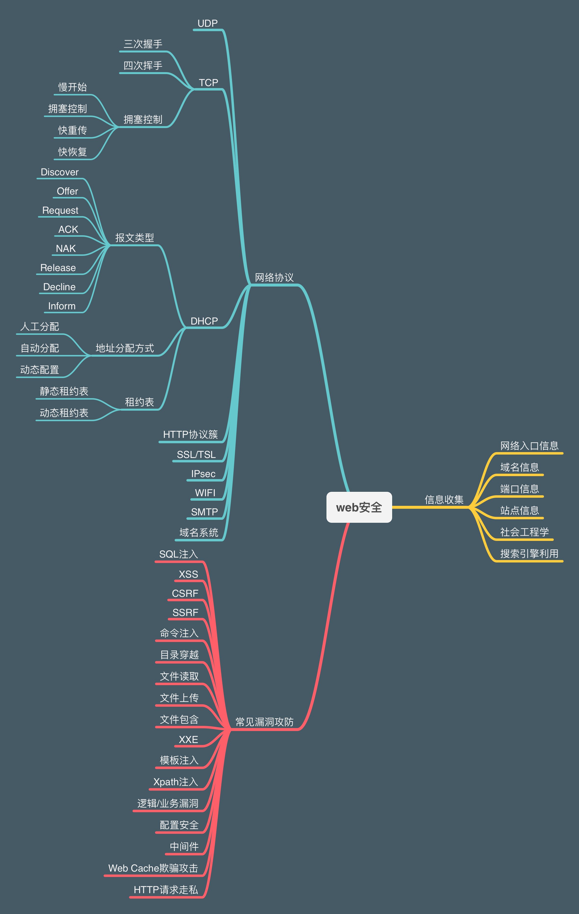
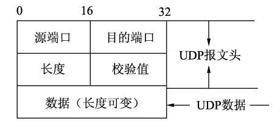
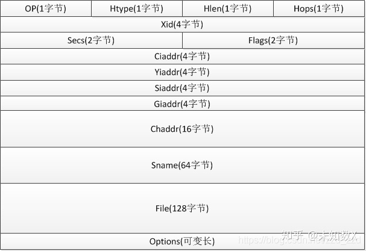

# Web 安全

> 个人总结web安全相关的脑图（持续更新中。。。。。。）

## 网络协议

- OSI七层模型与五层协议体系对照

### UDP协议

> 传输层协议、尽最大努力交付、不保证可靠性、无连接、无阻塞控制、首部开销小(8字节)
> 常用端口号: 53(DNS), 69(TFTP), 161(SNMP)等
> 使用UDP的上层协议: TFTP, DNS, SNMP, NFS, BOOTP等

- udp报文格式

- [百度百科UDP协议](https://baike.baidu.com/item/UDP)

### TCP协议

- TCP报文头

    - [TCP报文结构【CSDN】](https://blog.csdn.net/qq_16681169/article/details/50831856)

- [面试官，不要再问我三次握手和四次挥手【掘金】](https://juejin.cn/post/6844903958624878606#heading-0)

- [TCP拥塞控制【华为云】](https://www.huaweicloud.com/articles/912cb7c3b49f2a5bc792a140bb4d7a87.html)

- [TCP流量控制、拥塞控制【知乎】](https://zhuanlan.zhihu.com/p/37379780)

### DHCP协议

> 动态主机配置协议 (Dynamic Host Configuration Protocol，DHCP) 是一个用于局域网的网络协议，位于OSI模型的应用层，使用UDP协议工作，主要用于自动分配IP地址给用户，方便管理员进行统一管理。
DHCP服务器端使用67/udp，客户端使用68/udp。DHCP运行分为四个基本过程，分别为请求IP租约、提供IP租约、选择IP租约和确认IP租约。客户端在获得了一个IP地址以后，就可以发送一个ARP请求来避免由于DHCP服务器地址池重叠而引发的IP冲突。

- [DHCP协议详解【知乎】](https://zhuanlan.zhihu.com/p/265293856)

### 路由算法

> 从源路由器到目的路由器的最佳路径算法
- [路由算法【web安全学习笔记】](https://websec.readthedocs.io/zh/latest/network/route.html)

#### 要求

- 正确性
- 简单性
- 自适应性
- 稳定性
- 公平性
- 最优性

#### 路由选择协议类型

- 内部网关协议IGP(Interior Gateway Protocol)，在一个AS(Autonomous System，自治系统)
- 外部网关协议EGP(External Gateway Protocol)，不在一个AS

#### 常见路由协议

- RIP(Routing Infomation Protocol)，路由信息协议
- OSPF(Open Shortest Path Frist)，开放最短路径优先
- BGP-4(Boreder Gateway Protocol)，边界网关协议

- [“RIP协议”与“OSPF协议”的相同点与不同点是什么？【简书】](https://www.jianshu.com/p/2898dc090e1d)
- [RIP路由协议【简书】](https://www.jianshu.com/p/f542d5b415a1)
- [开放式最短路径优先【维基百科】](https://zh.wikipedia.org/wiki/%E5%BC%80%E6%94%BE%E5%BC%8F%E6%9C%80%E7%9F%AD%E8%B7%AF%E5%BE%84%E4%BC%98%E5%85%88)

### HTTP协议簇

> [HTTP协议](https://blog.poetries.top/http-protocol/)

- [Cookie【维基百科】](https://zh.wikipedia.org/wiki/Cookie)

### 邮件协议簇

- [简单邮件传输协议SMTP【维基百科】](https://zh.wikipedia.org/wiki/%E7%AE%80%E5%8D%95%E9%82%AE%E4%BB%B6%E4%BC%A0%E8%BE%93%E5%8D%8F%E8%AE%AE)
- [POP3协议【百度百科】](https://baike.baidu.com/item/POP3)
- [IMAP【百度百科】](https://baike.baidu.com/item/imap)

#### 邮件的防护策略

- [SPF](https://websec.readthedocs.io/zh/latest/network/mail.html)
- [DKIM](https://websec.readthedocs.io/zh/latest/network/mail.html)
- [DMARC](https://websec.readthedocs.io/zh/latest/network/mail.html)

### SSL/TLS

### IPsec

### WIFI

## 常见Web安全

### 前端Html5存储

> 部分输入框的内容会被存储，例如搜索历史可能会被存在localStorage，可以通过输入框将攻击代码插入到存储中，最后在其他用户使用该设备访问网站的时候，就可能会触发代码从而达成攻击目的。

- [靶场](https://tofu.exeye.run/local)

### 打破网页结构

> 部分输入可能最后又会被返回到前端页面上来，例如在输入一段字符后，可能经过某些转化后，这些东西会以某种形式出现在某个标签的属性上，我们就可以输入东西，使得标签闭合，然后插入我们的攻击代码。

- [靶场](https://tofu.exeye.run/dom)
- [靶场](https://tofu.exeye.run/output)

### 过滤逃逸

> 网址可能对<和>等符号过滤了，这个时候我们不能提前闭合标签，破坏网页结构，这个时候我们可以采用其他方式来逃逸过滤。例如利用"提前闭合属性，然后再加入一个事件属性，例如onclick事件，然后在其中插入我们的攻击代码，从而完成过滤逃逸。当然，还有可能也过滤了事件属性，例如onclcik，为了逃逸过滤，我们可以使用重复组合属性（例如ononclickclick，过滤掉中间的onclick后，正好剩下的字符又组成了onclcik），来完成过滤逃逸。

- [靶场](https://tofu.exeye.run/event)
- [靶场](https://tofu.exeye.run/commit/log_page)

### 突破长度限制

> 某些输入框的内容长度被限制了，所以我们不能将我们的攻击代码插入到内容中，这个时候我们就要利用其它条件来完成长度突破，例如使用eval函数，将我们的攻击代码拼接到链接后边，然后当我们点击链接后，通过取到链接上的攻击代码，然后使用eval来运行从链接上取到的代码，然后达到攻击目的。某些时候，我们可以通过查看网站原本封装好的一些函数，来以更短的字符取到我们想要的值。

- [靶场](https://tofu.exeye.run/limit)

### 用户提权

> 某些输入框可能存在sql注入漏洞，这样，我们可以通过。我们可以通过输入框的值注入我们要运行的sql，改变我们的用户权限，达到提权的目的。

- [靶场](https://tofu.exeye.run/sql/log_page)
