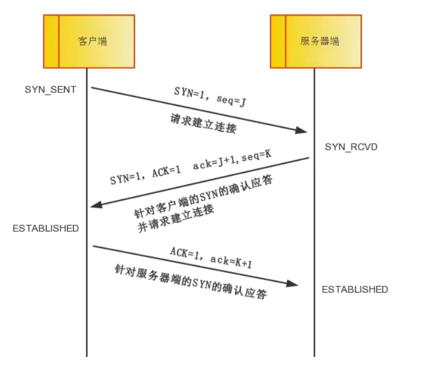
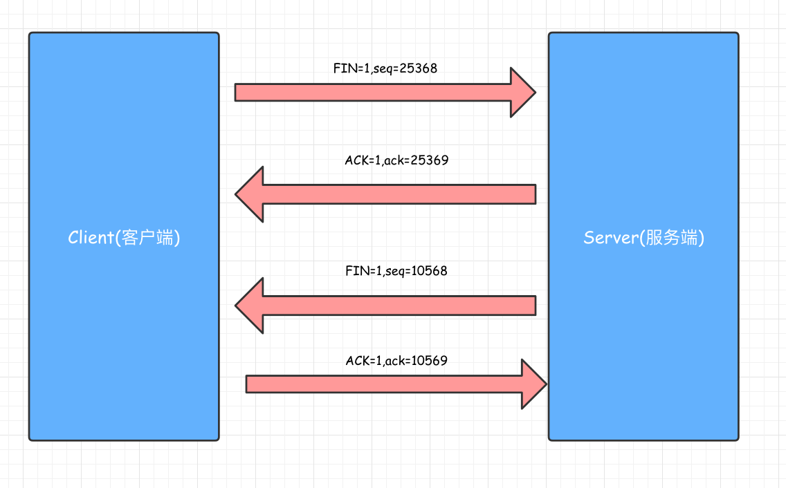

# Http

## Tcp 头部格式

- 端口号：用于确认进程，ip由上层Ip协议负责传递
- 序号(Sequence number) seq
- 确认号(Acknowledge number) ack
- SYN：S，同步标识为
- ACK：.，确认标志位
- FIN：F，完成标志位
- PSH：P，推送标志位
- RST：R，重置标志位
- URG：U，紧急标志位

## 三次握手和四次挥手

## 为什么握手三次，挥手四次？

- tcp是全双工通信，握手SYN用于同步，ACK用于确认，三次握手足够确认双方都可通信
- 四次挥手是因为当客户端发送FIN标志再无数据发送后，服务端仍可继续发送，此时客户端不会断开socket，所以需要服务端发送FIN标志再无数据发送后才会断开socket